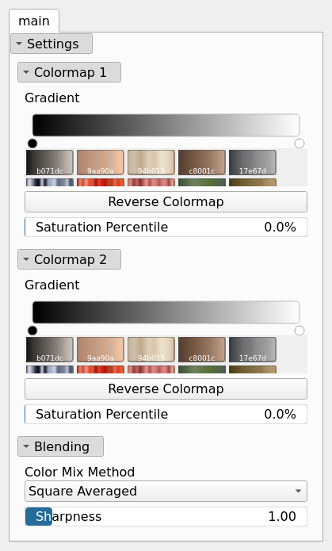

ColorizeBivariate Node
======================

ColorizeBivariate generates a texture by colorizing two scalar fields using two custom color gradients and blending them according to a chosen mixing method.

## Category

Texture
## Inputs

|Name|Type|Description|
| :--- | :--- | :--- |
|input1|VirtualArray|First data values field for color selection.|
|input2|VirtualArray|Second data values field for color selection.|
|noise|VirtualArray|Noise for dithering (shared between input 1 and input 2).|

## Outputs

|Name|Type|Description|
| :--- | :--- | :--- |
|texture|VirtualTexture|Output colorized texture.|

## Parameters

|Name|Type|Description|
| :--- | :--- | :--- |
|Gradient|Color gradient|Colormap as a manually defined color gradient for input 1.|
|Gradient|Color gradient|Colormap as a manually defined color gradient for input 2.|
|Color Mix Method|Enumeration|Mixing method used to blend the colors from both colormaps.|
|Reverse Colormap|Bool|Reverse the colormap 1 range.|
|Reverse Colormap|Bool|Reverse the colormap 2 range.|
|Saturation Percentile|Float|Saturation percentile for normalization of input 1.|
|Saturation Percentile|Float|Saturation percentile for normalization of input 2.|
|Sharpness|Float|Sharpness of the transition between the two colormaps.|

## Example

!!! note "No example yet"
    No example available for this node.
