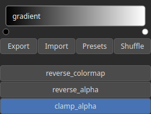

ColorizeGradient Node
=====================

ColorizeGradient generates a texture based on colormaps to assign colors to data values.

# Category

Texture
# Inputs

|Name|Type|Description|
| :--- | :--- | :--- |
|alpha|Heightmap|Texture alpha map.|
|level|Heightmap|Data values for color selection.|
|noise|Heightmap|TODO|

# Outputs

|Name|Type|Description|
| :--- | :--- | :--- |
|texture|HeightmapRGBA|Texture (RGBA).|

# Parameters

|Name|Type|Description|
| :--- | :--- | :--- |
|clamp_alpha|Bool|Clamp to [0, 1] to input alpha map.|
|gradient|Color gradient|Colormap as a manually defined color gradient.|
|reverse_alpha|Bool|Reverse the input alpha map.|
|reverse_colormap|Bool|Reverse the colormap range.|

# Example

