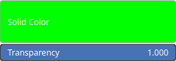

ColorizeSolid Node
==================

ColorizeSolid generates an uniform texture based on an input color.

# Category

Texture
# Inputs

|Name|Type|Description|
| :--- | :--- | :--- |
|alpha|VirtualArray|No description|

# Outputs

|Name|Type|Description|
| :--- | :--- | :--- |
|texture|VirtualTexture|Texture (RGBA).|

# Parameters

|Name|Type|Description|
| :--- | :--- | :--- |
|Transparency|Float|Transparency as a scalar value|
|Solid Color|Color|Solid color.|

# Example

No example available.  
