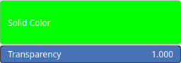

ColorizeSolid Node
==================

ColorizeSolid generates an uniform texture based on an input color.

## Category

Texture
## Inputs

|Name|Type|Description|
| :--- | :--- | :--- |
|alpha|VirtualArray|No description|

## Outputs

|Name|Type|Description|
| :--- | :--- | :--- |
|texture|VirtualTexture|Texture (RGBA).|

## Parameters

|Name|Type|Description|
| :--- | :--- | :--- |
|Transparency|Float|Transparency as a scalar value|
|Solid Color|Color|Solid color.|

## Example

Corresponding Hesiod file: [ColorizeSolid.hsd](../../examples/ColorizeSolid.hsd). Use [Ctrl+I] in the node editor to import a hsd file within your current project.

!!! note
    Example files are kept up-to-date with the latest version of [Hesiod](https://github.com/otto-link/Hesiod).
    If you find an error, please [open an issue](https://github.com/otto-link/Hesiod/issues).

