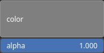

ColorizeSolid Node
==================

ColorizeSolid generates an uniform texture based on an input color.

# Category

Texture
# Outputs

|Name|Type|Description|
| :--- | :--- | :--- |
|texture|HeightmapRGBA|Texture (RGBA).|

# Parameters

|Name|Type|Description|
| :--- | :--- | :--- |
|alpha|Float|Transparency as a scalar value|
|color|Color|Solid color.|

# Example

No example available.