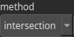

CombineMask Node
================

CombineMask performs basic logical operations on a pair of heightmaps (assuming they are used as masks).

# Category

Mask
# Inputs

|Name|Type|Description|
| :--- | :--- | :--- |
|input 1|Heightmap|Input mask.|
|input 2|Heightmap|Input mask.|

# Outputs

|Name|Type|Description|
| :--- | :--- | :--- |
|output|Heightmap|Combined mask.|

# Parameters

|Name|Type|Description|
| :--- | :--- | :--- |
|method|Enumeration|Combining method. Available values: exclusion, intersection, union.|

# Example

