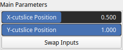

Compare Node
============

Displays a split view of two arrays using a horizontal and vertical slice.

# Category

Debug
# Inputs

|Name|Type|Description|
| :--- | :--- | :--- |
|a|VirtualArray|First input array (top-left region).|
|b|VirtualArray|Second input array (bottom-right region).|

# Outputs

|Name|Type|Description|
| :--- | :--- | :--- |
|output|VirtualArray|Resulting array combining a and b based on slice position.|

# Parameters

|Name|Type|Description|
| :--- | :--- | :--- |
|X-cutslice Position|Float|Normalized horizontal slice position (0 = left, 1 = right).|
|Y-cutslice Position|Float|Normalized vertical slice position (0 = top, 1 = bottom).|
|Swap Inputs|Bool|Swaps the roles of input arrays a and b.|

# Example

No example available.  
