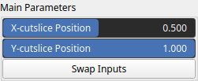

Compare Node
============

Displays a split view of two arrays using a horizontal and vertical slice.

## Category

Debug
## Inputs

|Name|Type|Description|
| :--- | :--- | :--- |
|a|VirtualArray|First input array (top-left region).|
|b|VirtualArray|Second input array (bottom-right region).|

## Outputs

|Name|Type|Description|
| :--- | :--- | :--- |
|output|VirtualArray|Resulting array combining a and b based on slice position.|

## Parameters

|Name|Type|Description|
| :--- | :--- | :--- |
|X-cutslice Position|Float|Normalized horizontal slice position (0 = left, 1 = right).|
|Y-cutslice Position|Float|Normalized vertical slice position (0 = top, 1 = bottom).|
|Swap Inputs|Bool|Swaps the roles of input arrays a and b.|

## Example

Corresponding Hesiod file: [Compare.hsd](../../examples/Compare.hsd). Use [Ctrl+I] in the node editor to import a hsd file within your current project.

!!! note
    Example files are kept up-to-date with the latest version of [Hesiod](https://github.com/otto-link/Hesiod).
    If you find an error, please [open an issue](https://github.com/otto-link/Hesiod/issues).

