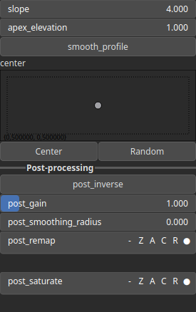

Cone Node
=========

Generates a conical heightmap.

# Category

Primitive/Function
# Inputs

|Name|Type|Description|
| :--- | :--- | :--- |
|dx|Heightmap|Displacement with respect to the domain size (x-direction).|
|dy|Heightmap|Displacement with respect to the domain size (y-direction).|
|envelope|Heightmap|Heightmap used as a post-process amplitude multiplier for the generated noise.|

# Outputs

|Name|Type|Description|
| :--- | :--- | :--- |
|output|Heightmap|Generated conical heightfield.|

# Parameters

|Name|Type|Description|
| :--- | :--- | :--- |
|apex_elevation|Float|Apex elevation.|
|center|Vec2Float|Center position of the cone in world coordinate space.|
|Gain|Float|Set the gain. Gain is a power law transformation altering the distribution of signal values, compressing or expanding certain regions of the signal depending on the exponent of the power law.|
|Invert Output|Bool|Inverts the output values after processing, flipping low and high values across the midrange.|
|Remap Range|Value range|Linearly remaps the output values to a specified target range (default is [0, 1]).|
|Saturation Range|Value range|Modifies the amplitude of elevations by first clamping them to a given interval and then scaling them so that the restricted interval matches the original input range. This enhances contrast in elevation variations while maintaining overall structure.|
|Smoothing Radius|Float|Defines the radius for post-processing smoothing, determining the size of the neighborhood used to average local values and reduce high-frequency detail. A radius of 0 disables smoothing.|
|slope|Float|Slope angle of the cone (controls steepness of the sides).|
|smooth_profile|Bool|Smoothen transition to zero.|

# Example

No example available.