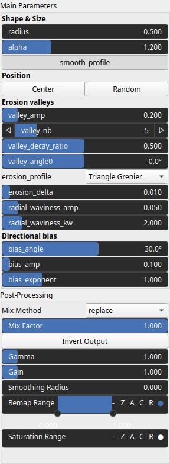

ConeComplex Node
================

Generates a complex conical heightfield with valleys, directional bias, and radial waviness.

# Category

Primitive/Function
# Inputs

|Name|Type|Description|
| :--- | :--- | :--- |
|control|Heightmap|Optional control map modulating local valley amplitude.|
|dx|Heightmap|Optional X-displacement noise field for coordinate perturbation.|
|dy|Heightmap|Optional Y-displacement noise field for coordinate perturbation.|
|envelope|Heightmap|Optional mask controlling the effective region of the generated cone.|

# Outputs

|Name|Type|Description|
| :--- | :--- | :--- |
|output|Heightmap|Generated conical heightfield.|

# Parameters

|Name|Type|Description|
| :--- | :--- | :--- |
|alpha|Float|Exponent controlling the steepness of the cone slope.|
|bias_amp|Float|Amplitude of the directional bias effect.|
|bias_angle|Float|Direction of the slope bias in degrees.|
|bias_exponent|Float|Controls how bias strength varies with radius.|
|center|Vec2Float|Center position of the cone in world coordinate space.|
|erosion_delta|Float|Smoothing parameter for the erosion profile function.|
|erosion_profile|Enumeration|Erosion profile type used to shape the valley cross-sections.|
|post_gain|Float|Set the gain. Gain is a power law transformation altering the distribution of signal values, compressing or expanding certain regions of the signal depending on the exponent of the power law.|
|post_inverse|Bool|Inverts the output values after processing, flipping low and high values across the midrange.|
|post_remap|Value range|Linearly remaps the output values to a specified target range (default is [0, 1]).|
|post_saturate|Value range|Modifies the amplitude of elevations by first clamping them to a given interval and then scaling them so that the restricted interval matches the original input range. This enhances contrast in elevation variations while maintaining overall structure.|
|post_smoothing_radius|Float|Defines the radius for post-processing smoothing, determining the size of the neighborhood used to average local values and reduce high-frequency detail. A radius of 0 disables smoothing.|
|radial_waviness_amp|Float|Amplitude of radial sinusoidal perturbations (coastal waviness).|
|radial_waviness_kw|Float|Frequency multiplier controlling the rate of radial waviness.|
|radius|Float|Effective radius of the cone in coordinate space units.|
|smooth_profile|Bool|No description|
|valley_amp|Float|Global amplitude of valley depressions.|
|valley_angle0|Float|Angular offset of the first valley in degrees.|
|valley_decay_ratio|Float|Controls how valley amplitude decays toward the center.|
|valley_nb|Integer|Number of valleys arranged radially around the cone.|

# Example

No example available.