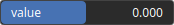

Constant Node
=============

No description available

## Category

Primitive/Function
## Outputs

|Name|Type|Description|
| :--- | :--- | :--- |
|output|VirtualArray|No description|

## Parameters

|Name|Type|Description|
| :--- | :--- | :--- |
|value|Float|No description|

## Example

Corresponding Hesiod file: [Constant.hsd](../../examples/Constant.hsd). Use [Ctrl+I] in the node editor to import a hsd file within your current project.

!!! note
    Example files are kept up-to-date with the latest version of [Hesiod](https://github.com/otto-link/Hesiod).
    If you find an error, please [open an issue](https://github.com/otto-link/Hesiod/issues).

