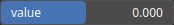

Constant Node
=============

No description available

# Category

Primitive/Function
# Outputs

|Name|Type|Description|
| :--- | :--- | :--- |
|output|Heightmap|No description|

# Parameters

|Name|Type|Description|
| :--- | :--- | :--- |
|value|Float|No description|

# Example

