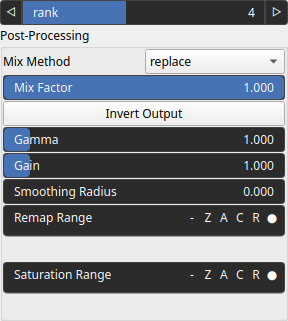

ConvolveSVD Node
================

ConvolveSVD performs convolution using a Singular Value Decomposition (SVD) of the kernel to accelerate the process.

# Category

Math/Convolution
# Inputs

|Name|Type|Description|
| :--- | :--- | :--- |
|input|Heightmap|Input heightmap.|
|kernel|Array|Convolution kernel.|

# Outputs

|Name|Type|Description|
| :--- | :--- | :--- |
|output|Heightmap|Output heightmap.|

# Parameters

|Name|Type|Description|
| :--- | :--- | :--- |
|post_gain|Float|No description|
|post_inverse|Bool|No description|
|post_mix|Float|No description|
|post_mix_method|Enumeration|No description|
|post_remap|Value range|No description|
|post_smoothing_radius|Float|No description|
|rank|Integer|Rank of the singular value decomposition.|

# Example

