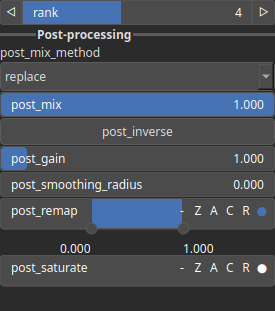

ConvolveSVD Node
================

ConvolveSVD performs convolution using a Singular Value Decomposition (SVD) of the kernel to accelerate the process.

# Category

Math/Convolution
# Inputs

|Name|Type|Description|
| :--- | :--- | :--- |
|input|Heightmap|Input heightmap.|
|kernel|Array|Convolution kernel.|

# Outputs

|Name|Type|Description|
| :--- | :--- | :--- |
|output|Heightmap|Output heightmap.|

# Parameters

|Name|Type|Description|
| :--- | :--- | :--- |
|rank|Integer|Rank of the singular value decomposition.|
|remap|Value range|Remap the operator's output to a specified range, defaulting to [0, 1].|

# Example

