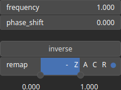

Cos Node
========

Apply a cosine function to every values.

# Category

Math/Base
# Inputs

|Name|Type|Description|
| :--- | :--- | :--- |
|input|Heightmap|Input heightmap.|

# Outputs

|Name|Type|Description|
| :--- | :--- | :--- |
|output|Heightmap|Output heightmap.|

# Parameters

|Name|Type|Description|
| :--- | :--- | :--- |
|frequency|Float|Frequency.|
|inverse|Bool|Toggle inversion of the output values.|
|phase_shift|Float|Phase shift.|
|remap|Value range|Remap the operator's output to a specified range, defaulting to [0, 1].|

# Example

No example available.