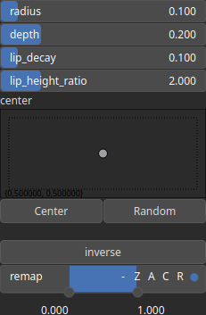

Crater Node
===========

Crater generates a crater landscape..

# Category

Primitive/Geological
# Inputs

|Name|Type|Description|
| :--- | :--- | :--- |
|control|Heightmap|Control parameter, acts as a multiplier for the weight parameter.|
|dx|Heightmap|Displacement with respect to the domain size (x-direction).|
|dy|Heightmap|Displacement with respect to the domain size (y-direction).|

# Outputs

|Name|Type|Description|
| :--- | :--- | :--- |
|output|Heightmap|Crater heightmap.|

# Parameters

|Name|Type|Description|
| :--- | :--- | :--- |
|center|Vec2Float|Reference center within the heightmap.|
|depth|Float|Crater depth.|
|inverse|Bool|Toggle inversion of the output values.|
|lip_decay|Float|Ejecta lip decay.|
|lip_height_ratio|Float|Controls the ejecta lip relative height.|
|radius|Float|Crater radius.|
|remap|Value range|Remap the operator's output to a specified range, defaulting to [0, 1].|

# Example

No example available.