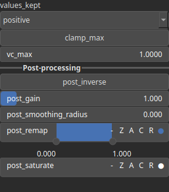

CurvatureMean Node
==================

No description available

# Category

Features
# Inputs

|Name|Type|Description|
| :--- | :--- | :--- |
|input|Heightmap|No description|

# Outputs

|Name|Type|Description|
| :--- | :--- | :--- |
|output|Heightmap|No description|

# Parameters

|Name|Type|Description|
| :--- | :--- | :--- |
|clamp_max|Bool|No description|
|positive|Bool|No description|
|post_gain|Float|No description|
|post_inverse|Bool|No description|
|post_remap|Value range|No description|
|post_smoothing_radius|Float|No description|
|vc_max|Float|No description|

# Example

No example available.