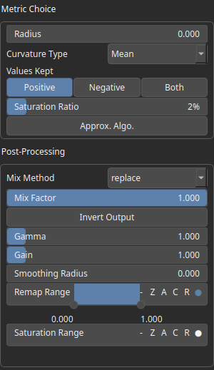

Curvatures Node
===============

No description available

# Category

Terrain Features
# Inputs

|Name|Type|Description|
| :--- | :--- | :--- |
|input|VirtualArray|No description|

# Outputs

|Name|Type|Description|
| :--- | :--- | :--- |
|mask|VirtualArray|No description|

# Parameters

|Name|Type|Description|
| :--- | :--- | :--- |
|Approx. Algo.|Bool|No description|
|Values Kept|Choice|No description|
|Curvature Type|Enumeration|No description|
|Gain|Float|No description|
|Gamma|Float|No description|
|Invert Output|Bool|No description|
|Mix Factor|Float|No description|
|Mix Method|Enumeration|No description|
|Remap Range|Value range|No description|
|Saturation Range|Value range|No description|
|Smoothing Radius|Float|No description|
|Radius|Float|No description|
|Saturation Ratio|Float|No description|

# Example

No example available.