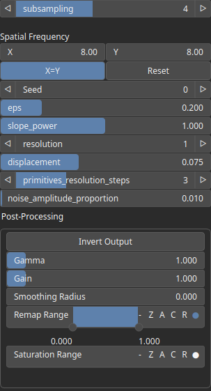

Dendry Node
===========

Dendry is a procedural model for dendritic patterns generation.

# Category

WIP
# Inputs

|Name|Type|Description|
| :--- | :--- | :--- |
|control|VirtualArray|Global control heightmap that defines the overall shape of the output.|
|dx|VirtualArray|Displacement with respect to the domain size (x-direction).|
|dy|VirtualArray|Displacement with respect to the domain size (y-direction).|
|envelope|VirtualArray|Heightmap used as a post-process amplitude multiplier for the generated noise.|

# Outputs

|Name|Type|Description|
| :--- | :--- | :--- |
|out|VirtualArray|TODO|

# Parameters

|Name|Type|Description|
| :--- | :--- | :--- |
|displacement|Float|Maximum displacement of segments.|
|eps|Float|Used to bias the area where points are generated in cells.|
|Spatial Frequency|Wavenumber|Base spatial frequencies in the X and Y directions. The frequencies are defined with respect to the entire domain: for example, kw = 2 produces two full oscillations across the domain width (and similarly for the Y direction).|
|noise_amplitude_proportion|Float|Proportion of the amplitude of the control function as noise.|
|Gain|Float|Mid-centered gain transformation applied to the elevation values. This is a non-linear recurve operator centered around the mid elevation (typically 0.5). Increasing the gain pushes values toward the minimum and maximum elevations, creating flatter low/high regions with a steeper transition around the midpoint.|
|Gamma|Float|Standard gamma correction applied to the elevation values. This is a monotonic power-law remapping that shifts emphasis toward low or high elevations, making the overall shape sharper or bulkier without changing its ordering.|
|Invert Output|Bool|Inverts the output values after processing, flipping low and high values across the midrange.|
|Remap Range|Value range|Linearly remaps the output values to a specified target range (default is [0, 1]).|
|Saturation Range|Value range|Modifies the amplitude of elevations by first clamping them to a given interval and then scaling them so that the restricted interval matches the original input range. This enhances contrast in elevation variations while maintaining overall structure.|
|Smoothing Radius|Float|Defines the radius for post-processing smoothing, determining the size of the neighborhood used to average local values and reduce high-frequency detail. A radius of 0 disables smoothing.|
|primitives_resolution_steps|Integer|Additional resolution steps in the primitive resolution.|
|resolution|Integer|Number of resolutions in the noise function.|
|Seed|Random seed number|Random seed number. The random seed is an offset to the randomized process. A different seed will produce a new result.|
|slope_power|Float|Additional parameter to control the variation of slope on terrains.|
|subsampling|Integer|Function evaluation subsampling, use higher values for faster computation at the cost of a coarser resolution.|

# Example

No example available.