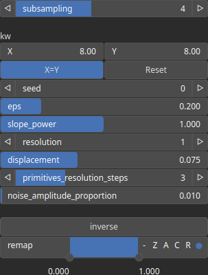

Dendry Node
===========

Dendry is a procedural model for dendritic patterns generation.

# Category

Primitive/Coherent
# Inputs

|Name|Type|Description|
| :--- | :--- | :--- |
|control|Heightmap|Global control heightmap that defines the overall shape of the output.|
|dx|Heightmap|Displacement with respect to the domain size (x-direction).|
|dy|Heightmap|Displacement with respect to the domain size (y-direction).|
|envelope|Heightmap|Heightmap used as a post-process amplitude multiplier for the generated noise.|

# Outputs

|Name|Type|Description|
| :--- | :--- | :--- |
|out|Heightmap|TODO|

# Parameters

|Name|Type|Description|
| :--- | :--- | :--- |
|displacement|Float|Maximum displacement of segments.|
|eps|Float|Used to bias the area where points are generated in cells.|
|inverse|Bool|Toggle inversion of the output values.|
|Spatial Frequency|Wavenumber|Base spatial frequencies in the X and Y directions. The frequencies are defined with respect to the entire domain: for example, kw = 2 produces two full oscillations across the domain width (and similarly for the Y direction).|
|noise_amplitude_proportion|Float|Proportion of the amplitude of the control function as noise.|
|primitives_resolution_steps|Integer|Additional resolution steps in the primitive resolution.|
|remap|Value range|Remap the operator's output to a specified range, defaulting to [0, 1].|
|resolution|Integer|Number of resolutions in the noise function.|
|Seed|Random seed number|Random seed number. The random seed is an offset to the randomized process. A different seed will produce a new result.|
|slope_power|Float|Additional parameter to control the variation of slope on terrains.|
|subsampling|Integer|Function evaluation subsampling, use higher values for faster computation at the cost of a coarser resolution.|

# Example

No example available.