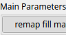

DepressionFilling Node
======================

DepressionFilling is used to fill depressions or sinks in an heightmap. It ensures that there are no depressions, i.e. areas within a digital elevation model that are surrounded by higher terrain, with no outlet to lower areas.

# Category

Erosion
# Inputs

|Name|Type|Description|
| :--- | :--- | :--- |
|input|VirtualArray|Input heightmap.|

# Outputs

|Name|Type|Description|
| :--- | :--- | :--- |
|fill map|VirtualArray|Filling map.|
|output|VirtualArray|Filled heightmap.|

# Parameters

|Name|Type|Description|
| :--- | :--- | :--- |
|remap fill map|Bool|Remap to [0, 1] the filling map.|

# Example

No example available.