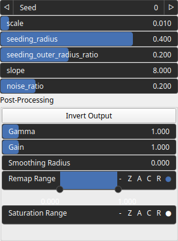

DiffusionLimitedAggregation Node
================================

DiffusionLimitedAggregation creates branching, fractal-like structures that resemble the rugged, irregular contours of mountain ranges.

# Category

WIP
# Outputs

|Name|Type|Description|
| :--- | :--- | :--- |
|output|VirtualArray|DiffusionLimitedAggregation heightmap.|

# Parameters

|Name|Type|Description|
| :--- | :--- | :--- |
|noise_ratio|Float| A parameter that controls the amount of randomness or noise introduced in the talus formation process.|
|Gain|Float|Mid-centered gain transformation applied to the elevation values. This is a non-linear recurve operator centered around the mid elevation (typically 0.5). Increasing the gain pushes values toward the minimum and maximum elevations, creating flatter low/high regions with a steeper transition around the midpoint.|
|Gamma|Float|Standard gamma correction applied to the elevation values. This is a monotonic power-law remapping that shifts emphasis toward low or high elevations, making the overall shape sharper or bulkier without changing its ordering.|
|Invert Output|Bool|Inverts the output values after processing, flipping low and high values across the midrange.|
|Remap Range|Value range|Linearly remaps the output values to a specified target range (default is [0, 1]).|
|Saturation Range|Value range|Modifies the amplitude of elevations by first clamping them to a given interval and then scaling them so that the restricted interval matches the original input range. This enhances contrast in elevation variations while maintaining overall structure.|
|Smoothing Radius|Float|Defines the radius for post-processing smoothing, determining the size of the neighborhood used to average local values and reduce high-frequency detail. A radius of 0 disables smoothing.|
|scale|Float|A scaling factor that influences the density of the particles in the DLA pattern.|
|Seed|Random seed number|Random seed number. The random seed is an offset to the randomized process. A different seed will produce a new result.|
|seeding_outer_radius_ratio|Float|The ratio between the outer seeding radius and the initial seeding radius. It determines the outer boundary for particle seeding.|
|seeding_radius|Float|The radius within which initial seeding of particles occurs. This radius defines the area where the first particles are placed.|
|slope|Float|Slope of the talus added to the DLA pattern.|

# Example

No example available.  
