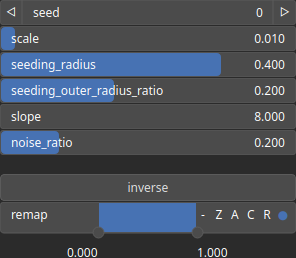

DiffusionLimitedAggregation Node
================================

DiffusionLimitedAggregation creates branching, fractal-like structures that resemble the rugged, irregular contours of mountain ranges.

# Category

WIP
# Outputs

|Name|Type|Description|
| :--- | :--- | :--- |
|output|Heightmap|DiffusionLimitedAggregation heightmap.|

# Parameters

|Name|Type|Description|
| :--- | :--- | :--- |
|inverse|Bool|Toggle inversion of the output values.|
|noise_ratio|Float| A parameter that controls the amount of randomness or noise introduced in the talus formation process.|
|remap|Value range|Remap the operator's output to a specified range, defaulting to [0, 1].|
|scale|Float|A scaling factor that influences the density of the particles in the DLA pattern.|
|seed|Random seed number|The seed for the random number generator.|
|seeding_outer_radius_ratio|Float|The ratio between the outer seeding radius and the initial seeding radius. It determines the outer boundary for particle seeding.|
|seeding_radius|Float|The radius within which initial seeding of particles occurs. This radius defines the area where the first particles are placed.|
|slope|Float|Slope of the talus added to the DLA pattern.|

# Example

No example available.