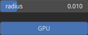

Dilation Node
=============

Dilation expands the boundaries of objects in an image and fills in small gaps or holes in those objects. Use Cases: (+) Filling gaps: Dilation can be used to fill small gaps or holes in objects, making them more solid. (+) Merging objects: Dilation can help merge nearby objects or connect broken segments in an image.

# Category

Operator/Morphology
# Inputs

|Name|Type|Description|
| :--- | :--- | :--- |
|input|Heightmap|Input heightmap.|

# Outputs

|Name|Type|Description|
| :--- | :--- | :--- |
|output|Heightmap|Dilated heightmap.|

# Parameters

|Name|Type|Description|
| :--- | :--- | :--- |
|radius|Float|Filter radius with respect to the domain size.|

# Example

No example available.