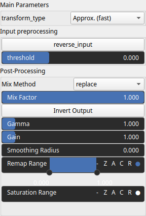

DistanceTransform Node
======================

Generates a distance map where each pixel's value represents the shortest distance to the nearest non-zero value in the input heightmap.

# Category

Operator/Morphology
# Inputs

|Name|Type|Description|
| :--- | :--- | :--- |
|input|Heightmap|Input heightmap used to compute the distance transform.|

# Outputs

|Name|Type|Description|
| :--- | :--- | :--- |
|output|Heightmap|Generated distance map based on the input heightmap.|

# Parameters

|Name|Type|Description|
| :--- | :--- | :--- |
|Gain|Float|Mid-centered gain transformation applied to the elevation values. This is a non-linear recurve operator centered around the mid elevation (typically 0.5). Increasing the gain pushes values toward the minimum and maximum elevations, creating flatter low/high regions with a steeper transition around the midpoint.|
|Gamma|Float|Standard gamma correction applied to the elevation values. This is a monotonic power-law remapping that shifts emphasis toward low or high elevations, making the overall shape sharper or bulkier without changing its ordering.|
|Invert Output|Bool|Inverts the output values after processing, flipping low and high values across the midrange.|
|Mix Factor|Float|Mixing factor for blending input and output values. A value of 0 uses only the input, 1 uses only the output, and intermediate values perform a linear interpolation.|
|Mix Method|Enumeration|Method used to combine input and output values. Options include linear interpolation (default), min, max, smooth min, smooth max, add, and subtract.|
|Remap Range|Value range|Linearly remaps the output values to a specified target range (default is [0, 1]).|
|Saturation Range|Value range|Modifies the amplitude of elevations by first clamping them to a given interval and then scaling them so that the restricted interval matches the original input range. This enhances contrast in elevation variations while maintaining overall structure.|
|Smoothing Radius|Float|Defines the radius for post-processing smoothing, determining the size of the neighborhood used to average local values and reduce high-frequency detail. A radius of 0 disables smoothing.|
|reverse_input|Bool|Invert the input values before processing.|
|threshold|Float|Defines the cutoff value for considering non-zero input pixels.|
|transform_type|Enumeration|Specifies the distance metric used for transformation (e.g., Euclidean, Manhattan, or Chessboard distance).|

# Example

No example available.