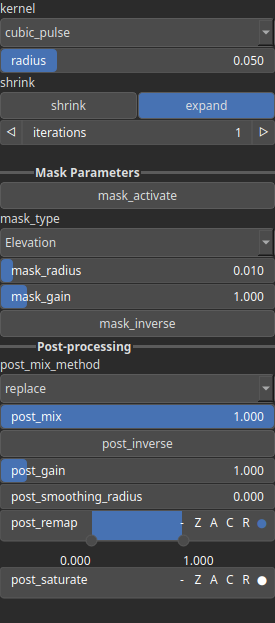

ExpandShrink Node
=================

ExpandShrink is a maximum/minimum filter with a weighted kernel. It can be used to enhance or extract features while preserving the essential structure of the heightmap.

# Category

Filter/Recast
# Inputs

|Name|Type|Description|
| :--- | :--- | :--- |
|input|Heightmap|Input heightmap.|
|mask|Heightmap|Mask defining the filtering intensity (expected in [0, 1]).|

# Outputs

|Name|Type|Description|
| :--- | :--- | :--- |
|output|Heightmap|Filtered heightmap.|

# Parameters

|Name|Type|Description|
| :--- | :--- | :--- |
|GPU|Bool|Toogle GPU acceleration on or off.|
|kernel|Enumeration|Weighting kernel. Available values: biweight, cone, cone_smooth, cubic_pulse, disk, lorentzian, smooth_cosine, square, tricube.|
|radius|Float|Filter radius with respect to the domain size.|
|shrink|Bool|Shrink (if true) or expand (if false).|

# Example

