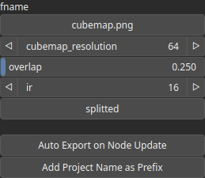

ExportAsCubemap Node
====================

TODO

# Category

WIP
# Inputs

|Name|Type|Description|
| :--- | :--- | :--- |
|input|VirtualArray|TODO|

# Parameters

|Name|Type|Description|
| :--- | :--- | :--- |
|Add Project Name as Prefix|Bool|No description|
|Auto Export on Node Update|Bool|Controls whether the output file is automatically written when the node is updated. Default is false. When set to true, the file is saved automatically on updates. If false, use the 'Force Reload' button on the node to manually trigger the export.|
|cubemap_resolution|Integer|TODO|
|fname|Filename|TODO|
|ir|Integer|TODO|
|overlap|Float|TODO|
|splitted|Bool|TODO|

# Example

No example available.  
