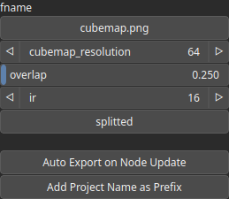

ExportAsCubemap Node
====================

TODO

## Category

WIP
## Inputs

|Name|Type|Description|
| :--- | :--- | :--- |
|input|VirtualArray|TODO|

## Parameters

|Name|Type|Description|
| :--- | :--- | :--- |
|Auto Export on Node Update|Bool|Controls whether the output file is automatically written when the node is updated. Default is false. When set to true, the file is saved automatically on updates. If false, use the 'Force Reload' button on the node to manually trigger the export.|
|cubemap_resolution|Integer|TODO|
|Flip-X|Bool|No description|
|Flip-Y|Bool|No description|
|fname|Filename|TODO|
|ir|Integer|TODO|
|overlap|Float|TODO|
|Filename Pattern|String|No description|
|splitted|Bool|TODO|

## Example

!!! note "No example yet"
    No example available for this node.
