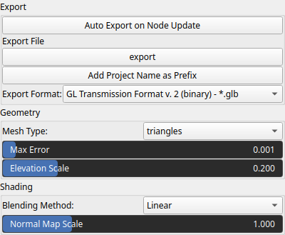

ExportAsset Node
================

Exports both the heightmap and texture as a single asset. The mesh can either be used as is or retriangulated using an optimization algorithm. Additionally, a normal map can be provided to model light effects of small details not represented by the mesh.

## Category

Export
## Inputs

|Name|Type|Description|
| :--- | :--- | :--- |
|elevation|VirtualArray|Heightmap data defining elevation values.|
|mask|VirtualArray|Optional mask defining which cells are exported. Masked cells are omitted from the mesh, producing holes. When a mask is used, retriangulation is not available and the mesh is exported at full resolution.|
|normal map details|VirtualTexture|Optional normal map for enhancing lighting effects on small details.|
|texture|VirtualTexture|Heightmap data defining texture color values.|

## Parameters

|Name|Type|Description|
| :--- | :--- | :--- |
|Auto Export on Node Update|Bool|Controls whether the output file is automatically written when the node is updated. Default is false. When set to true, the file is saved automatically on updates. If false, use the 'Force Reload' button on the node to manually trigger the export.|
|Blending Method:|Enumeration|Defines the method used to blend the normal map for small details.|
|Normal Map Scale|Float|Scaling factor applied to the detail normal map.|
|Elevation Scale|Float|Factor used to scale elevation values.|
|Export Format:|Enumeration|Defines the file format for export. Available formats include Assimp Binary (*.assbin), Assxml Document (*.assxml), Autodesk 3DS (*.3ds), Autodesk FBX (ASCII/Binary) (*.fbx), COLLADA (*.dae), Extensible 3D (*.x3d), GL Transmission Format (GLB/GLTF v1 & v2), Stanford Polygon Library (*.ply), Step Files (*.stp), Stereolithography (*.stl), 3MF (*.3mf), and Wavefront OBJ (*.obj) with or without material files.|
|Fit Boundaries|Bool|If enabled, domain coordinates are scaled to exactly [0, 1] x [0, 1] to fit the boundary. Default is false (coordinates scaled to [0, 1 - 1/shape.x] x [0, 1 - 1/shape.y]).|
|Flip-X|Bool|No description|
|Flip-Y|Bool|No description|
|Export File|Filename|Specifies the name of the exported file.|
|Max Error|Float|Maximum allowable error when generating an optimized triangulated mesh.|
|Mesh Type:|Enumeration|Specifies the type of mesh geometry used. Options include 'triangles' and 'triangles (optimized)'.|
|Filename Pattern|String|No description|

## Example

Corresponding Hesiod file: [ExportAsset.hsd](../../examples/ExportAsset.hsd). Use [Ctrl+I] in the node editor to import a hsd file within your current project.

!!! note
    Example files are kept up-to-date with the latest version of [Hesiod](https://github.com/otto-link/Hesiod).
    If you find an error, please [open an issue](https://github.com/otto-link/Hesiod/issues).

