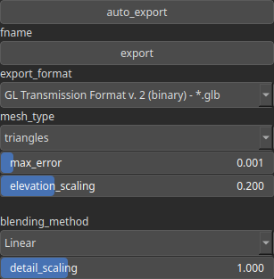

ExportAsset Node
================

Exports both the heightmap and texture as a single asset. The mesh can either be used as is or retriangulated using an optimization algorithm. Additionally, a normal map can be provided to model light effects of small details not represented by the mesh.

# Category

IO/Files
# Inputs

|Name|Type|Description|
| :--- | :--- | :--- |
|elevation|Heightmap|Heightmap data defining elevation values.|
|normal map details|HeightmapRGBA|Optional normal map for enhancing lighting effects on small details.|
|texture|HeightmapRGBA|Heightmap data defining texture color values.|

# Parameters

|Name|Type|Description|
| :--- | :--- | :--- |
|auto_export|Bool|Controls whether the output file is automatically written when the node is updated. Default is false. When set to true, the file is saved automatically on updates. If false, use the 'Force Reload' button on the node to manually trigger the export.|
|blending_method|Enumeration|Defines the method used to blend the normal map for small details.|
|detail_scaling|Float|Scaling factor applied to the detail normal map.|
|elevation_scaling|Float|Factor used to scale elevation values.|
|export_format|Enumeration|Defines the file format for export. Available formats include Assimp Binary (*.assbin), Assxml Document (*.assxml), Autodesk 3DS (*.3ds), Autodesk FBX (ASCII/Binary) (*.fbx), COLLADA (*.dae), Extensible 3D (*.x3d), GL Transmission Format (GLB/GLTF v1 & v2), Stanford Polygon Library (*.ply), Step Files (*.stp), Stereolithography (*.stl), 3MF (*.3mf), and Wavefront OBJ (*.obj) with or without material files.|
|fname|Filename|Specifies the name of the exported file.|
|max_error|Float|Maximum allowable error when generating an optimized triangulated mesh.|
|mesh_type|Enumeration|Specifies the type of mesh geometry used. Options include 'triangles' and 'triangles (optimized)'.|

# Example

No example available.