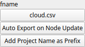

ExportCloud Node
================

ExportCloud is an operator for exporting cloud data to a csv file.

# Category

IO/Files
# Inputs

|Name|Type|Description|
| :--- | :--- | :--- |
|input|Cloud|Input heightmap.|

# Parameters

|Name|Type|Description|
| :--- | :--- | :--- |
|auto_export|Bool|Controls whether the output file is automatically written when the node is updated. Default is false. When set to true, the file is saved automatically on updates. If false, use the 'Force Reload' button on the node to manually trigger the export.|
|fname|Filename|Export file name.|

# Example

