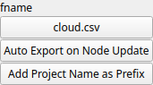

ExportCloud Node
================

ExportCloud is an operator for exporting cloud data to a csv file.

## Category

Export
## Inputs

|Name|Type|Description|
| :--- | :--- | :--- |
|input|Cloud|Input heightmap.|

## Parameters

|Name|Type|Description|
| :--- | :--- | :--- |
|Auto Export on Node Update|Bool|Controls whether the output file is automatically written when the node is updated. Default is false. When set to true, the file is saved automatically on updates. If false, use the 'Force Reload' button on the node to manually trigger the export.|
|fname|Filename|Export file name.|
|Filename Pattern|String|No description|

## Example

Corresponding Hesiod file: [ExportCloud.hsd](../../examples/ExportCloud.hsd). Use [Ctrl+I] in the node editor to import a hsd file within your current project.

!!! note
    Example files are kept up-to-date with the latest version of [Hesiod](https://github.com/otto-link/Hesiod).
    If you find an error, please [open an issue](https://github.com/otto-link/Hesiod/issues).

