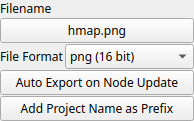

ExportHeightmap Node
====================

ExportHeightmap is an operator for exporting a heightmap in various file formats.

# Category

IO/Files
# Inputs

|Name|Type|Description|
| :--- | :--- | :--- |
|input|VirtualArray|Input heightmap.|

# Parameters

|Name|Type|Description|
| :--- | :--- | :--- |
|Add Project Name as Prefix|Bool|No description|
|Auto Export on Node Update|Bool|Controls whether the output file is automatically written when the node is updated. Default is false. When set to true, the file is saved automatically on updates. If false, use the 'Force Reload' button on the node to manually trigger the export.|
|Filename|Filename|Export file name.|
|File Format|Enumeration|Export format. Available values: png (16 bit), png (8 bit), raw (16 bit, Unity).|

# Example

No example available.