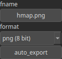

ExportHeightmap Node
====================

ExportHeightmap is an operator for exporting a heightmap in various file formats.

# Category

IO/Files
# Inputs

|Name|Type|Description|
| :--- | :--- | :--- |
|input|Heightmap|Input heightmap.|

# Parameters

|Name|Type|Description|
| :--- | :--- | :--- |
|auto_export|Bool|Controls whether the output file is automatically written when the node is updated. Default is false. When set to true, the file is saved automatically on updates. If false, use the 'Force Reload' button on the node to manually trigger the export.|
|fname|Filename|Export file name.|
|format|Enumeration|Export format. Available values: png (16 bit), png (8 bit), raw (16 bit, Unity).|

# Example

No example available.