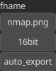

ExportNormalMap Node
====================

ExportNormalMap is an operator for exporting the normal map of an heightmap as a PNG image file.

# Category

IO/Files
# Inputs

|Name|Type|Description|
| :--- | :--- | :--- |
|input|Heightmap|Input heightmap.|

# Parameters

|Name|Type|Description|
| :--- | :--- | :--- |
|16bit|Bool|Whether the output file is a 16bit PNG file (instead of 8bit).|
|auto_export|Bool|Controls whether the output file is automatically written when the node is updated. Default is false. When set to true, the file is saved automatically on updates. If false, use the 'Force Reload' button on the node to manually trigger the export.|
|fname|Filename|Export file name.|

# Example

No example available.