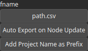

ExportPath Node
===============

ExportPath is an operator for exporting path data to a csv file.

# Category

IO/Files
# Inputs

|Name|Type|Description|
| :--- | :--- | :--- |
|input|Path|Input heightmap.|

# Parameters

|Name|Type|Description|
| :--- | :--- | :--- |
|Add Project Name as Prefix|Bool|No description|
|Auto Export on Node Update|Bool|Controls whether the output file is automatically written when the node is updated. Default is false. When set to true, the file is saved automatically on updates. If false, use the 'Force Reload' button on the node to manually trigger the export.|
|fname|Filename|Export file name.|

# Example

No example available.