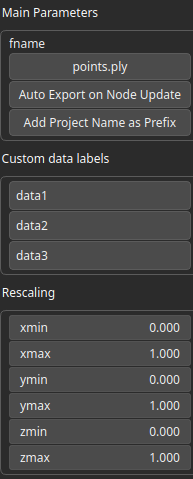
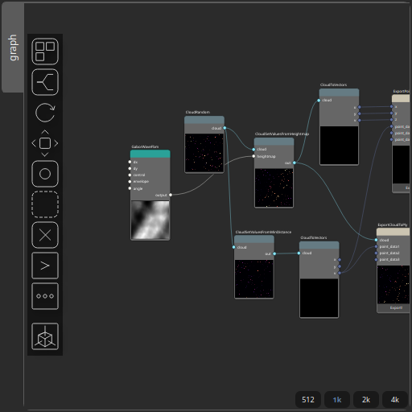

ExportPointsToPly Node
======================

No description available

# Category

IO/Files
# Inputs

|Name|Type|Description|
| :--- | :--- | :--- |
|point_data1|vector<float>|No description|
|point_data2|vector<float>|No description|
|point_data3|vector<float>|No description|
|x|vector<float>|No description|
|y|vector<float>|No description|
|z|vector<float>|No description|

# Parameters

|Name|Type|Description|
| :--- | :--- | :--- |
|auto_export|Bool|No description|
|fname|Filename|No description|
||String|No description|
||String|No description|
||String|No description|

# Example

Corresponding Hesiod file: [ExportPointsToPly.hsd](../../examples/ExportPointsToPly.hsd). Use [Ctrl+I] in the node editor to import a hsd file within your current project. 

> **Note:** Example files are kept up-to-date with the latest version of [Hesiod](https://github.com/otto-link/Hesiod).
> If you find an error, please [open an issue](https://github.com/otto-link/Hesiod/issues).

