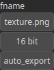

ExportTexture Node
==================

ExportTexture is a texture to a PNG image file.

# Category

IO/Files
# Inputs

|Name|Type|Description|
| :--- | :--- | :--- |
|texture|HeightmapRGBA|Input texture.|

# Parameters

|Name|Type|Description|
| :--- | :--- | :--- |
|16 bit|Bool|Decides whether the output is an 8 bit or a 16 bit PNG file.|
|auto_export|Bool|Controls whether the output file is automatically written when the node is updated. Default is false. When set to true, the file is saved automatically on updates. If false, use the 'Force Reload' button on the node to manually trigger the export.|
|fname|Filename|Export file name.|

# Example

