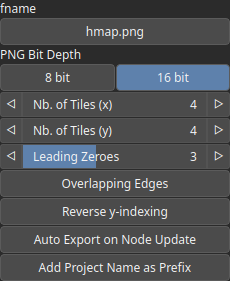

ExportTiled Node
================

No description available

## Category

Export
## Inputs

|Name|Type|Description|
| :--- | :--- | :--- |
|input|VirtualArray|No description|

## Parameters

|Name|Type|Description|
| :--- | :--- | :--- |
|Auto Export on Node Update|Bool|No description|
|PNG Bit Depth|Choice|No description|
|Flip-X|Bool|No description|
|Flip-Y|Bool|No description|
|fname|Filename|No description|
|Leading Zeroes|Integer|No description|
|Overlapping Edges|Bool|No description|
|Filename Pattern|String|No description|
|Reverse y-indexing|Bool|No description|
|Nb. of Tiles (x)|Integer|No description|
|Nb. of Tiles (y)|Integer|No description|

## Example

Corresponding Hesiod file: [ExportTiled.hsd](../../examples/ExportTiled.hsd). Use [Ctrl+I] in the node editor to import a hsd file within your current project.

!!! note
    Example files are kept up-to-date with the latest version of [Hesiod](https://github.com/otto-link/Hesiod).
    If you find an error, please [open an issue](https://github.com/otto-link/Hesiod/issues).

