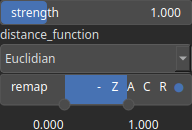

Falloff Node
============

Falloff is an operator that enforces values close to zero at the domain edges.

# Category

Boundaries
# Inputs

|Name|Type|Description|
| :--- | :--- | :--- |
|dr|Heightmap|Displacement with respect to the domain size (radial direction).|
|input|Heightmap|Input heightmap.|

# Outputs

|Name|Type|Description|
| :--- | :--- | :--- |
|output|Heightmap|Filtered heightmap.|

# Parameters

|Name|Type|Description|
| :--- | :--- | :--- |
|distance_function|Enumeration|Measure used for the distance calculation. Available values: Chebyshev, Euclidian, Euclidian/Chebyshev, Manhattan.|
|remap|Value range|Remap the operator's output to a specified range, defaulting to [0, 1].|
|strength|Float|Falloff strength.|

# Example

No example available.