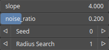

FillTalus Node
==============

Fill the heightmap starting from the highest elevations using a regular downslope.

## Category

Filter/Advanced Filters
## Inputs

|Name|Type|Description|
| :--- | :--- | :--- |
|input|VirtualArray|Input heightmap.|
|seed_mask|VirtualArray|No description|

## Outputs

|Name|Type|Description|
| :--- | :--- | :--- |
|output|VirtualArray|Output heightmap.|

## Parameters

|Name|Type|Description|
| :--- | :--- | :--- |
|Radius Search|Integer|No description|
|noise_ratio|Float|No description|
|Seed|Random seed number|Random seed number. The random seed is an offset to the randomized process. A different seed will produce a new result.|
|slope|Float|Downslope used for filling.|

## Example

Corresponding Hesiod file: [FillTalus.hsd](../../examples/FillTalus.hsd). Use [Ctrl+I] in the node editor to import a hsd file within your current project.

!!! note
    Example files are kept up-to-date with the latest version of [Hesiod](https://github.com/otto-link/Hesiod).
    If you find an error, please [open an issue](https://github.com/otto-link/Hesiod/issues).

