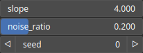

FillTalus Node
==============

Fill the heightmap starting from the highest elevations using a regular downslope.

# Category

WIP
# Inputs

|Name|Type|Description|
| :--- | :--- | :--- |
|input|Heightmap|Input heightmap.|

# Outputs

|Name|Type|Description|
| :--- | :--- | :--- |
|output|Heightmap|Output heightmap.|

# Parameters

|Name|Type|Description|
| :--- | :--- | :--- |
|noise_ratio|Float|Noise ratio, added to the downslope.|
|Seed|Random seed number|Random seed number. The random seed is an offset to the randomized process. A different seed will produce a new result.|
|slope|Float|Downslope used for filling.|

# Example

No example available.