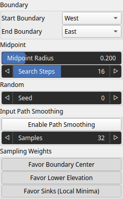
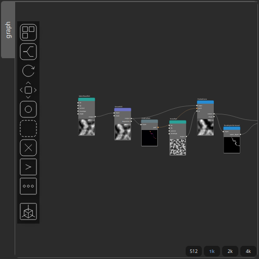

FindCutPath Node
================

Generates a path between two domain boundaries by selecting start and end points using weighted sampling and connecting them with a midpoint-based subdivision.

# Category

Geometry/Path
# Inputs

|Name|Type|Description|
| :--- | :--- | :--- |
|input|VirtualArray|Input scalar field used to guide boundary point selection (e.g., elevation map).|

# Outputs

|Name|Type|Description|
| :--- | :--- | :--- |
|path|Path|Generated path connecting the selected boundary points.|

# Parameters

|Name|Type|Description|
| :--- | :--- | :--- |
|End Boundary|Enumeration|Boundary where the path ends.|
|Favor Boundary Center|Bool|Biases selection toward the center of the boundary when randomly picking the start and end points.|
|Favor Lower Elevation|Bool|Biases selection toward lower values in the input field when randomly picking the start and end points.|
|Favor Sinks (Local Minima)|Bool|Biases selection toward local minima (cells lower than or equal to their neighbors) when randomly picking the start and end points.|
|Midpoint Iterations|Integer|Number of midpoint subdivision steps used to refine the path.|
|Midpoint Radius|Float|Controls the amplitude of midpoint displacement (path deviation).|
|Seed|Random seed number|Random seed number. The random seed is an offset to the randomized process. A different seed will produce a new result.|
|Start Boundary|Enumeration|Boundary where the path starts (e.g., West, East, North, South).|

# Example

Corresponding Hesiod file: [FindCutPath.hsd](../../examples/FindCutPath.hsd). Use [Ctrl+I] in the node editor to import a hsd file within your current project. 

> **Note:** Example files are kept up-to-date with the latest version of [Hesiod](https://github.com/otto-link/Hesiod).
> If you find an error, please [open an issue](https://github.com/otto-link/Hesiod/issues).

