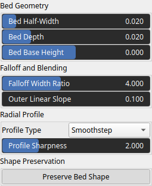
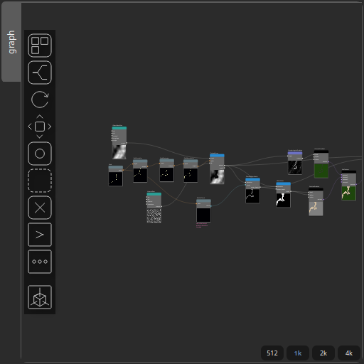

FlatbedCarve Node
=================

Carves and blends a flatbed shape along a path into an existing heightmap using a smooth radial falloff. The operator is typically used to create river beds, channels, or flattened corridors that follow a user-defined path.

# Category

Hydrology
# Inputs

|Name|Type|Description|
| :--- | :--- | :--- |
|dr|Heightmap|Optional radial noise map used to perturb the bed shape.|
|input|Heightmap|Input heightmap to be modified by the flatbed carving operation.|
|path|Path|Path defining the centerline along which the flatbed is carved.|

# Outputs

|Name|Type|Description|
| :--- | :--- | :--- |
|mask|Heightmap|Output falloff mask representing the influence region of the flatbed carve.|
|output|Heightmap|Resulting heightmap after carving and blending the flatbed along the path.|

# Parameters

|Name|Type|Description|
| :--- | :--- | :--- |
|Bed Half-Width|Float|Radius of the flatbed region measured from the path centerline, defining the half-width of the carved bed.|
|Bed Depth|Float|Vertical depth of the bed carved below the surrounding terrain.|
|Falloff Width Ratio|Float|Relative width of the smooth transition region outside the bed, expressed as a ratio of the bed half-width.|
|Outer Linear Slope|Float|Linear slope applied beyond the falloff region to smoothly reconnect the bed to the surrounding terrain.|
|Preserve Bed Shape|Bool|Preserves the original bed profile when radial noise is applied, preventing distortion of the flatbed shape.|
|Profile Type|Enumeration|Radial profile function used to define the cross-sectional shape of the bed (e.g. smoothstep, linear).|
|Profile Sharpness|Float|Shape parameter controlling the curvature or sharpness of the selected radial profile.|
|Bed Base Height|Float|Minimum height value assigned to the bed bottom, defining the base elevation of the carved region.|

# Example

Corresponding Hesiod file: [FlatbedCarve.hsd](../../examples/FlatbedCarve.hsd). Use [Ctrl+I] in the node editor to import a hsd file within your current project. 

> **Note:** Example files are kept up-to-date with the latest version of [Hesiod](https://github.com/otto-link/Hesiod).
> If you find an error, please [open an issue](https://github.com/otto-link/Hesiod/issues).

