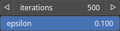
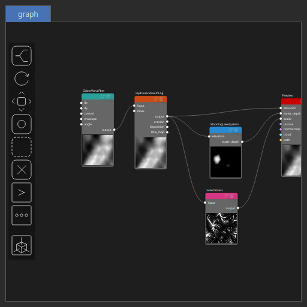

FloodingLakeSystem Node
=======================

Simulates lake formation on a terrain by filling topographic depressions. The algorithm analyzes the terrain elevation model, detects enclosed basins, and incrementally floods them to estimate lake water depths and extents. It applies a depression-filling method to determine the resulting water surface elevation.

# Category

Hydrology
# Inputs

|Name|Type|Description|
| :--- | :--- | :--- |
|elevation|Heightmap|Terrain elevation.|

# Outputs

|Name|Type|Description|
| :--- | :--- | :--- |
|water_depth|Heightmap|Output water depth map representing flooded areas.|

# Parameters

|Name|Type|Description|
| :--- | :--- | :--- |
|epsilon|Float|Convergence tolerance for the depression-filling process. Smaller values yield higher precision but may increase computation time.|
|iterations|Integer|Maximum number of iterations allowed during the depression-filling algorithm before convergence is assumed.|
|mininal_radius|Float|Minimum radius (in normalized terrain units) used to define the smallest valid lake surface. Water bodies smaller than this threshold are discarded.|

# Example

Corresponding Hesiod file: [FloodingLakeSystem.hsd](../../examples/FloodingLakeSystem.hsd). Use [Ctrl+I] in the node editor to import a hsd file within your current project. 

> **Note:** Example files are kept up-to-date with the latest version of [Hesiod](https://github.com/otto-link/Hesiod).
> If you find an error, please [open an issue](https://github.com/otto-link/Hesiod/issues).

