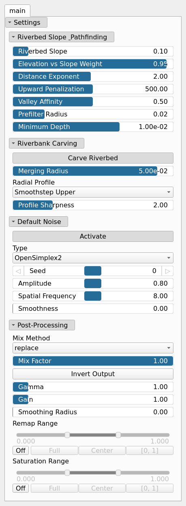

FlowFixingMST Node
==================

No description available

## Category

WIP
## Inputs

|Name|Type|Description|
| :--- | :--- | :--- |
|input|VirtualArray|No description|
|noise_r|VirtualArray|No description|

## Outputs

|Name|Type|Description|
| :--- | :--- | :--- |
|output|VirtualArray|No description|

## Parameters

|Name|Type|Description|
| :--- | :--- | :--- |
|Carve Riverbed|Bool|No description|
|Distance Exponent|Float|No description|
|Activate|Bool|Enables or disables the built-in drainage noise. If an external noise input is provided, it overrides this default noise.|
|Spatial Frequency|Float|Base spatial frequencies in the X and Y directions.|
|Amplitude|Float|Noise amplitude.|
|Type|Enumeration|Noise type.|
|Seed|Random seed number|Random seed number. The random seed is an offset to the randomized process. A different seed will produce a new result.|
|Smoothness|Float|Controls the resulting smoothness of the fractal layering process.|
|Elevation vs Slope Weight|Float|No description|
|Merging Radius|Float|No description|
|Minimum Depth|Float|No description|
|Gain|Float|Mid-centered gain transformation applied to the elevation values. This is a non-linear recurve operator centered around the mid elevation (typically 0.5). Increasing the gain pushes values toward the minimum and maximum elevations, creating flatter low/high regions with a steeper transition around the midpoint.|
|Gamma|Float|Standard gamma correction applied to the elevation values. This is a monotonic power-law remapping that shifts emphasis toward low or high elevations, making the overall shape sharper or bulkier without changing its ordering.|
|Invert Output|Bool|Inverts the output values after processing, flipping low and high values across the midrange.|
|Mix Factor|Float|Mixing factor for blending input and output values. A value of 0 uses only the input, 1 uses only the output, and intermediate values perform a linear interpolation.|
|Mix Method|Enumeration|Method used to combine input and output values. Options include linear interpolation (default), min, max, smooth min, smooth max, add, and subtract.|
|Remap Range|Value range|Linearly remaps the output values to a specified target range (default is [0, 1]).|
|Saturation Range|Value range|Modifies the amplitude of elevations by first clamping them to a given interval and then scaling them so that the restricted interval matches the original input range. This enhances contrast in elevation variations while maintaining overall structure.|
|Smoothing Radius|Float|Defines the radius for post-processing smoothing, determining the size of the neighborhood used to average local values and reduce high-frequency detail. A radius of 0 disables smoothing.|
|Prefilter Radius|Float|No description|
|Radial Profile|Enumeration|No description|
|Profile Sharpness|Float|No description|
|Riverbed Slope|Float|No description|
|Upward Penalization|Float|No description|
|Valley Affinity|Float|No description|

## Example

!!! note "No example yet"
    No example available for this node.
