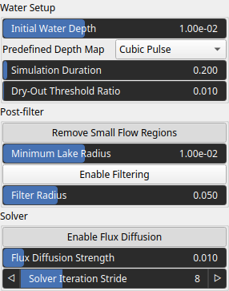

FlowSimulation Node
===================

No description available

# Category

Hydrology
# Inputs

|Name|Type|Description|
| :--- | :--- | :--- |
|depth_map|VirtualArray|No description|
|elevation|VirtualArray|No description|
|water_depth_in|VirtualArray|No description|

# Outputs

|Name|Type|Description|
| :--- | :--- | :--- |
|water_depth|VirtualArray|Output water depth map representing flooded areas.|

# Parameters

|Name|Type|Description|
| :--- | :--- | :--- |
|Dry-Out Threshold Ratio|Float|No description|
|Simulation Duration|Float|No description|
|Enable Flux Diffusion|Bool|No description|
|Flux Diffusion Strength|Float|No description|
|Enable Filtering|Bool|No description|
|Predefined Depth Map|Choice|No description|
|Filter Radius|Float|No description|
|Solver Iteration Stride|Integer|Grid sampling stride used by the solver. Higher values process the snow field at a lower spatial resolution, reducing computation time at the cost of fine detail.|
|Initial Water Depth|Float|No description|

# Example

No example available.