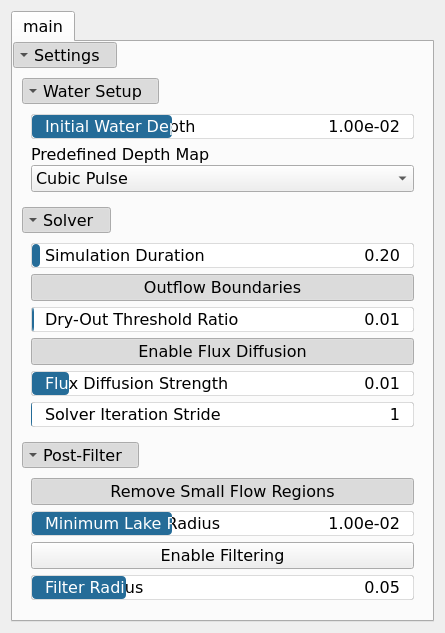

FlowSimulation Node
===================

No description available

## Category

Hydrology
## Inputs

|Name|Type|Description|
| :--- | :--- | :--- |
|depth_map|VirtualArray|No description|
|elevation|VirtualArray|No description|
|rain_map|VirtualArray|No description|
|water_depth_in|VirtualArray|No description|

## Outputs

|Name|Type|Description|
| :--- | :--- | :--- |
|water_depth|VirtualArray|Output water depth map representing flooded areas.|

## Parameters

|Name|Type|Description|
| :--- | :--- | :--- |
|Remove Small Flow Regions|Bool|No description|
|Predefined Depth Map|Enumeration|No description|
|Dry-Out Threshold Ratio|Float|No description|
|Simulation Duration|Float|No description|
|Enable Flux Diffusion|Bool|No description|
|Flux Diffusion Strength|Float|No description|
|Outflow Boundaries|Bool|No description|
|Enable Filtering|Bool|No description|
|Filter Radius|Float|No description|
|Minimum Lake Radius|Float|No description|
|Solver Iteration Stride|Integer|Grid sampling stride used by the solver. 1 (default) runs the simulation at full resolution. Higher values run it on a coarser grid and upsample the result, which is faster on very large maps but smears fine flow structure.|
|Initial Water Depth|Float|No description|

## Example

Corresponding Hesiod file: [FlowSimulation.hsd](../../examples/FlowSimulation.hsd). Use [Ctrl+I] in the node editor to import a hsd file within your current project.

!!! note
    Example files are kept up-to-date with the latest version of [Hesiod](https://github.com/otto-link/Hesiod).
    If you find an error, please [open an issue](https://github.com/otto-link/Hesiod/issues).

