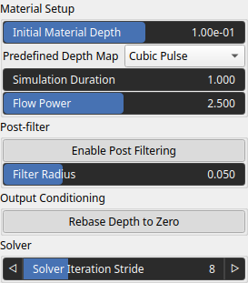
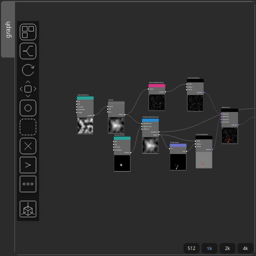

FlowSimulationViscous Node
==========================

No description available

# Category

Hydrology
# Inputs

|Name|Type|Description|
| :--- | :--- | :--- |
|depth_in|VirtualArray|No description|
|depth_map|VirtualArray|No description|
|elevation_in|VirtualArray|No description|

# Outputs

|Name|Type|Description|
| :--- | :--- | :--- |
|depth|VirtualArray|No description|
|elevation|VirtualArray|No description|

# Parameters

|Name|Type|Description|
| :--- | :--- | :--- |
|Filter Radius|Float|No description|
|Flow Power|Float|No description|
|Initial Material Depth|Float|No description|
|Enable Post Filtering|Bool|No description|
|Rebase Depth to Zero|Bool|No description|
|Simulation Duration|Float|No description|
|Solver Iteration Stride|Integer|No description|

# Example

Corresponding Hesiod file: [FlowSimulationViscous.hsd](../../examples/FlowSimulationViscous.hsd). Use [Ctrl+I] in the node editor to import a hsd file within your current project. 

> **Note:** Example files are kept up-to-date with the latest version of [Hesiod](https://github.com/otto-link/Hesiod).
> If you find an error, please [open an issue](https://github.com/otto-link/Hesiod/issues).

