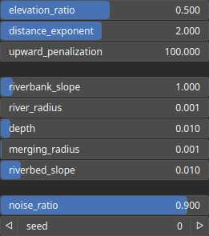

FlowStream Node
===============

TODO

# Category

WIP
# Inputs

|Name|Type|Description|
| :--- | :--- | :--- |
|input|Heightmap|TODO|
|sources|Cloud|TODO|

# Outputs

|Name|Type|Description|
| :--- | :--- | :--- |
|output|Heightmap|TODO|
|river_mask|Heightmap|TODO|

# Parameters

|Name|Type|Description|
| :--- | :--- | :--- |
|depth|Float|TODO|
|distance_exponent|Float|TODO|
|elevation_ratio|Float|TODO|
|merging_radius|Float|TODO|
|noise_ratio|Float|TODO|
|river_radius|Float|TODO|
|riverbank_slope|Float|TODO|
|riverbed_slope|Float|TODO|
|seed|Random seed number|TODO|
|upward_penalization|Float|TODO|

# Example

No example available.